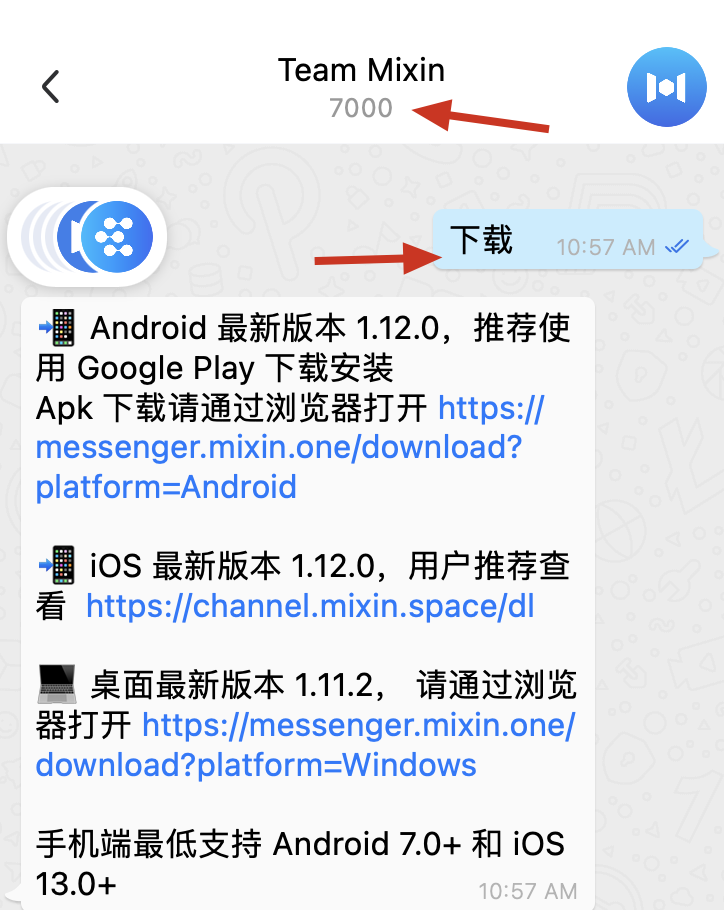
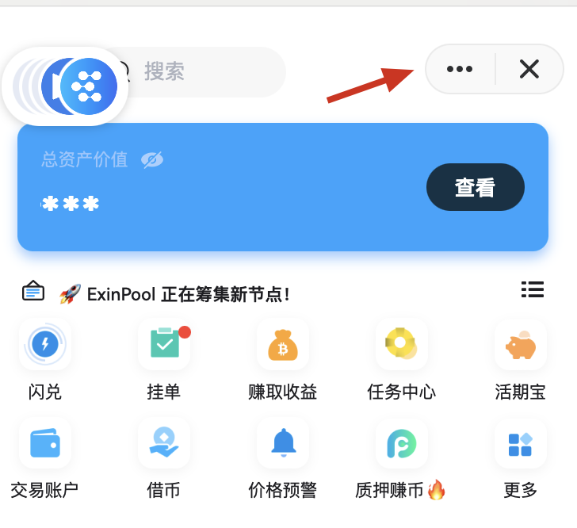
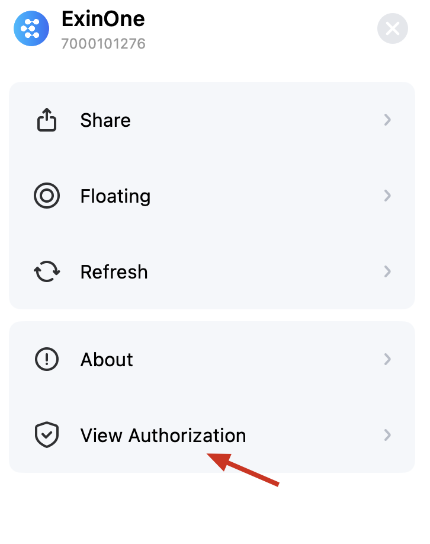
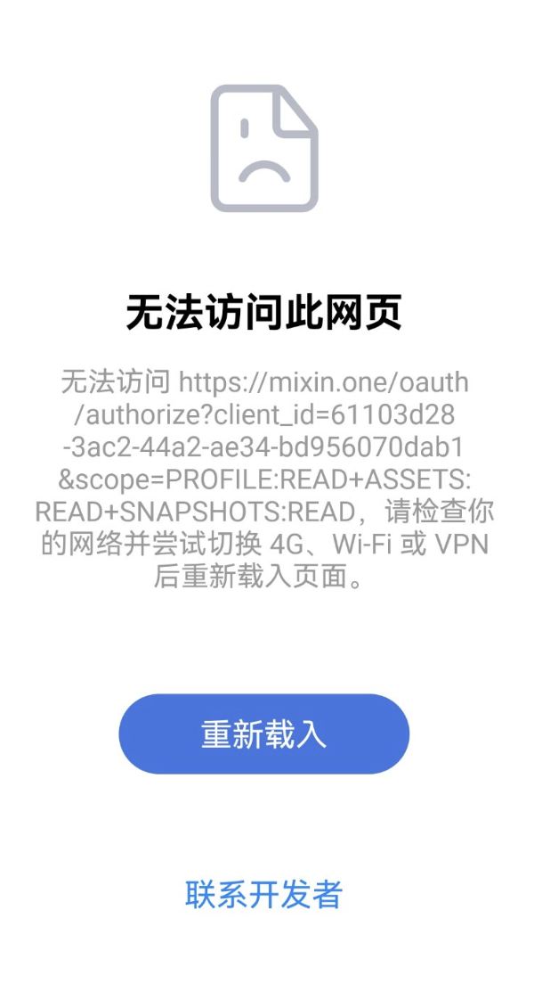

如果您无法正常进入 ExinOne 页面，请参考以下流程进行排查：

### 更新 Mixin 版本
Mixin 聊天页面搜索 7000 如下图，给这个机器人发送 “下载”，会触发关键词自动回复，请根据指引自行下载安装 Mixin 的最新版本

### 重新授权

ExinOne 打不开的页面的左上角有三个点，如下图

点击【查看授权】，然后取消给 ExinOne 的所有授权，之后，关掉 ExinOne，然后再重新打开，看看是否能正常打开。

### 切换网络
如果您遇到下图的显示内容，请根据报错内容自行切换网络尝试。
